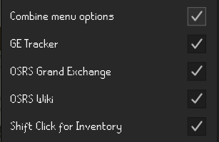
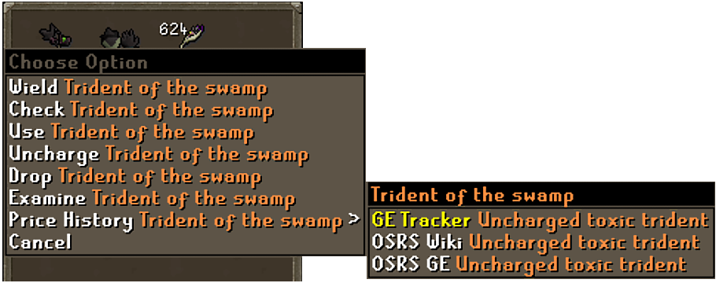
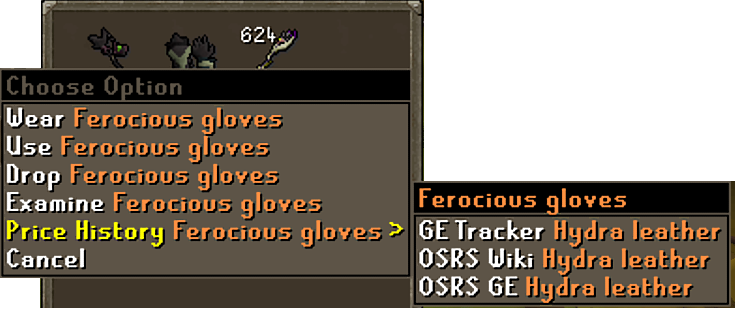
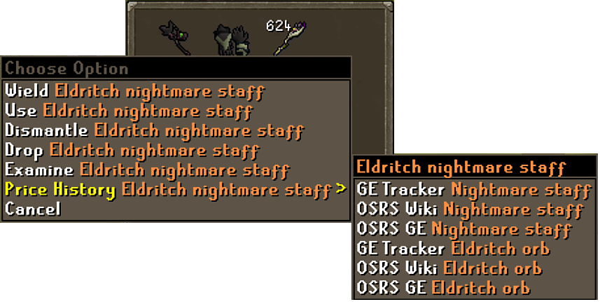
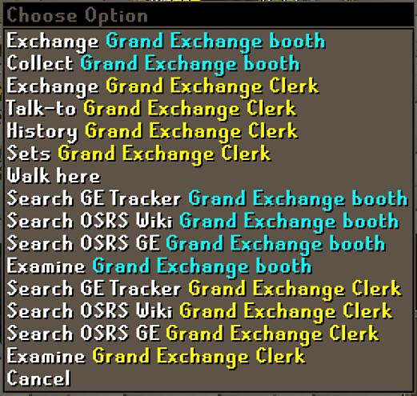
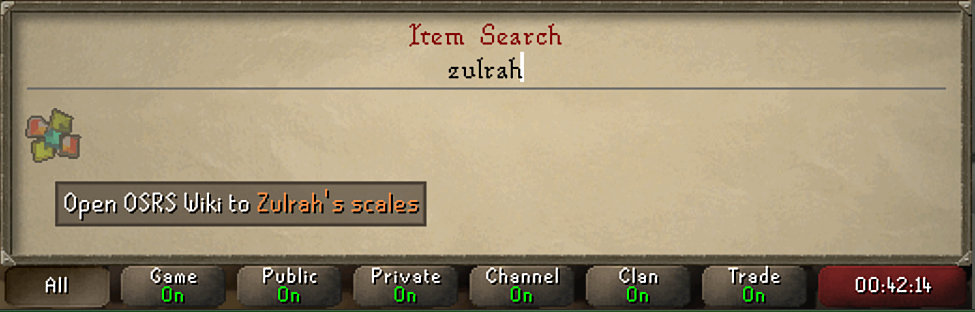

# Price Graph Opener
This plugin adds menu options for opening an item in various price history/flipping utilities.

Currently supported sites:
* [GE Tracker](https://www.ge-tracker.com/)
* [The OSRS Wiki](https://prices.runescape.wiki/osrs)
* [Official OSRS Grand Exchange](https://secure.runescape.com/m=itemdb_oldschool/)

## Options

* `Combine menu options` - Adds the entries into a RuneLite submenu when clicking on items.
Does not affect the Grand Exchange Clerk nor booth.
* `GE Tracker` - Include menu option to open directly in the GE Tracker website.
* `OSRS Grand Exchange` - Include menu option to open directly in the OSRS Grand Exchange website.
* `OSRS Wiki` - Include menu option to open directly in the OSRS Prices Wiki website.
* `Shift Click for Inventory` - Require Shift Click when not in a menu (bank, GE, store, etc.).

## Features
* Opens directly to an item's page in one of the above websites.
* Untradeable items will have their tradeable component(s) linked to
  * 
  * 
  * 
* Adds a search feature to the Grand Exchange Clerk and to the Grand Exchange booth for selected options.
Search is not tradeable-item safe.
  * 
  * 